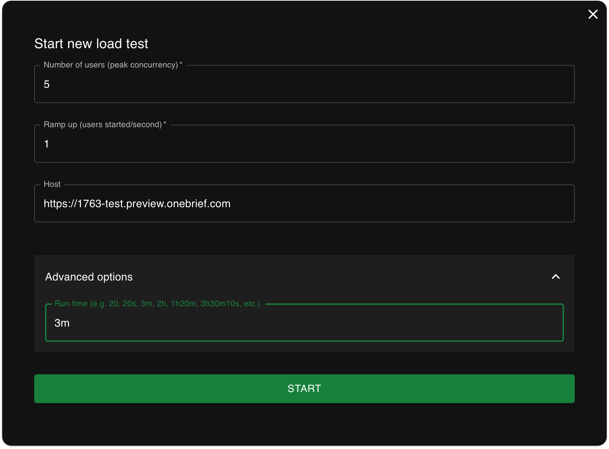

# About
Run configuration-based load tests using `Python` and `Locust`. 



1. Install — use python and a virtual env
2. Configure 
  ```bash
  ```
    
3. Run — `python setup.py && locust -f locustfile.py`
4. Optionally observe — login with a browser yourself to observe in real time, the graudally ramped up effects of load.


## Install
1. Set up the Python virtual env 
  - Note: if you've gone through this before, just skip ahead to step 2.
- Create and activate a virtual env
```bash 
python3 -m venv venv
source venv/bin/activate
```

2. Install `python` libraries
```bash
pip install --upgrade pip
pip install -r requirements.txt
```

3. Install Playwright Chromium browser
```bash
playwright install-deps chromium
```

4.  Confirm installation
```bash
locust -V       # locust 2.33.1
playwright -V   # Version 1.50.0

```

----
## Configure
Set the following:
```bash

```

## Run 
```bash
locust -f locustfile.py
```

# Deactivate the venv
When you're all done, deactivate the virtual environment. 
```bash
deactivate
```

# Reactivate the venv
If you want to run the locust tests again without having to re-install, just do this:
```bash
source ~/py_envs/bin/activate
locust -f locustfile.py
```

```
docker build -t locust-load-test .
docker run --rm -p 8089:8089 -v "$(pwd)/config:/app/config" locust-load-test
```